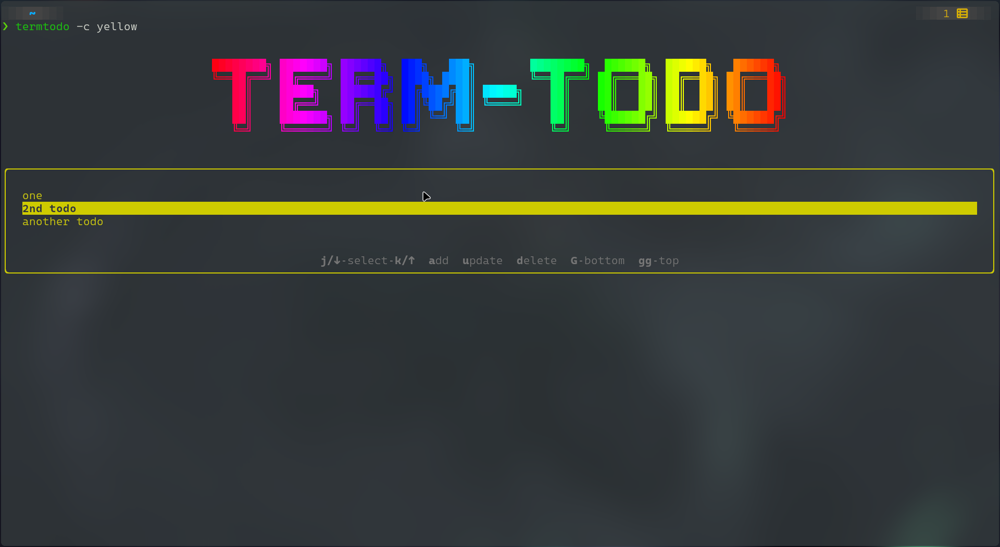

# TermTodo

**TermTodo** is a CLI-based to-do list manager built using the Ink library, which allows you to manage your tasks directly from the terminal

## Features

- **Navigate Todos**: Use `k`/`up arrow` to move up and `j`/`down arrow` to move down through your list of todos.
- **Add New Todo**: Press the `a` key to open a popup and add a new task.
- **Update Todo**: Select a todo using navigation keys, press the `u` key, and update your task in the popup.
- **Delete Todo**: Navigate to a todo and press the `d` key to remove it from your list.
- **Color Customization**: Highlight your todos with your preferred color using the `--color` flag.

## Installation

You can install TermTodo globally via npm or run it using Docker.

### NPM Installation

```bash
npm install -g @jignesh119/termtodo
```

### Docker

To run TermTodo using Docker, ensure you have Docker installed and run the following command:

```bash
docker run --rm -it --name termtodo <image_name>
```

_Note: The `-it` flag is necessary as the CLI requires tty, stdin, and stdout streams for interaction._

## Demo



## Usage

```bash
TermTodo - cli based todolist manager

Usage: termtodo [options] [value]
    $ termtodo
    $ termtodo --color <color>
    $ termtodo --help
    $ termtodo --version

Options:
    -c --color    Set color of highlighting
    -h --help     Show this screen
    -v --version  Show version

Examples:
    $ termtodo --help
    $ termtodo --color magenta
```

### Supported Colors for `--color` flag

- `yellow`
- `red`
- `blue`
- `cyan`
- `grey`
- `magenta`
- `green`

## Keyboard Shortcuts

- **Navigate Todos**: `k`/`up arrow` and `j`/`down arrow`
- **Add Todo**: `a`
- **Update Todo**: `u`
- **Delete Todo**: `d`

## Contributing

Contributions are welcome! Feel free to open an issue or submit a pull request on [GitHub](https://github.com/jignesh119/TermTodo).
